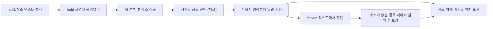
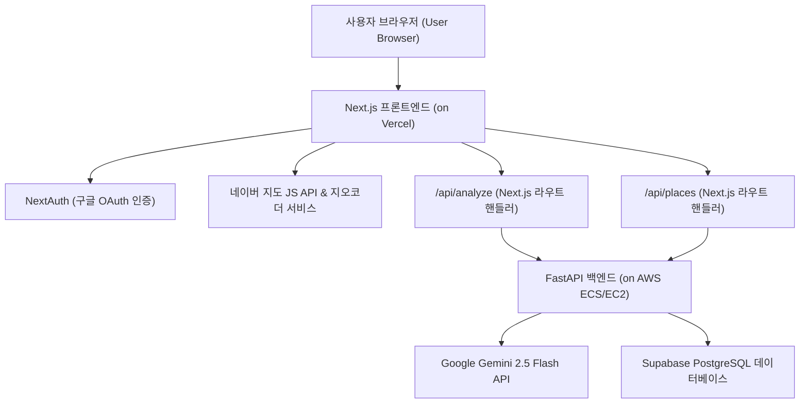

# 스플 (Sple)

> **대형 언어 모델(LLM: Large Language Model) 기반 텍스트 분석을 활용한 인스타그램 맛집 지도 서비스**


스플(Sple)은 인스타그램(Instagram)의 본문 텍스트나 맛집 소개 글을 복사해서 붙여넣으면, 인공지능(AI)이 장소 후보를 자동으로 추출해 주는 서비스입니다. 로그인한 사용자는 추출된 장소를 자신만의 맛집 지도와 리스트 형태의 컬렉션(Collection)으로 저장하고 언제든 다시 확인할 수 있습니다. 모바일 환경에 최적화된 프로그레시브 웹 애플리케이션(PWA: Progressive Web Application) 형태로 구성되어 있습니다.

현재 MVP(Minimum Viable Product: 최소 기능 제품) 단계의 범위는 **텍스트 복사 및 붙여넣기 기반의 장소 분석**에 집중하고 있습니다. (인스타그램 URL 직접 크롤링 및 Meta DM 자동화는 외부 플랫폼의 봇 탐지 정책과 권한 제약으로 인해 현재 범위에서 제외되었습니다.)

---

## 🔗 주요 링크 (Links)

- **라이브 데모(Live Demo)**: [https://www.sple-insta.com](https://www.sple-insta.com)
- **백엔드 API(Backend API)**: [https://api.sple-insta.com](https://api.sple-insta.com)
- **제품 요구사항 정의서**: [docs/CURRENT_PRODUCT_UNDERSTANDING.md](docs/CURRENT_PRODUCT_UNDERSTANDING.md)

---

## 💡 개발 배경 (Why)

인스타그램에서 가보고 싶은 맛집이나 카페를 발견하면 보통 '저장' 버튼을 누르지만, 나중에 실제로 방문하려고 할 때는 위치를 한눈에 파악하기 어렵고 다시 찾기도 번거롭습니다.

스플은 흩어져 있는 맛집 텍스트 데이터를 **'인공지능(AI) 분석 ➡️ 개인 지도 저장 ➡️ 지도 및 리스트를 통한 재탐색'**의 흐름으로 매끄럽게 연결합니다. 이를 통해 사용자가 발견한 장소들을 직관적이고 소중한 자신만의 핫플레이스 지도 컬렉션으로 만들어 줍니다.

---

## ✨ 핵심 기능 (Core Features)

### 1. 인공지능(AI) 기반 장소 추출
- 복사해서 붙여넣은 비정형 텍스트에서 인공지능(Gemini 2.5 Flash) 모델이 똑똑하게 장소의 상호명과 주소 후보를 찾아내 분석합니다.
- 해시태그(#)나 생략된 정보 속에서도 장소명을 적극적으로 유추하며, 텍스트 내에 여러 개의 장소가 포함되어 있어도 모두 찾아내 배열로 반환합니다.

### 2. 다중 장소 일괄 저장
- 한 번의 분석으로 추출된 여러 장소 후보를 체크리스트 형태로 화면에 깔끔하게 렌더링합니다.
- 사용자는 원하는 장소들만 쏙쏙 골라 한 번에 개인 컬렉션에 추가할 수 있습니다.

### 3. 지도 중심 장소 탐색
- 네이버 지도 자바스크립트 API(Naver Maps JavaScript API)를 활용하여 모바일에 최적화된 지도 홈 화면을 보여줍니다.
- 사용자가 기기의 위치 권한을 허용하면 현재 위치를 중심으로 지도가 열리며, 저장된 장소들은 좌표값에 맞추어 마커(Marker: 지도 핀)로 깔끔하게 시각화됩니다.

### 4. 유연한 저장 및 주소 정보 보강 (Geocoding)
- 맛집 콘텐츠에는 상호명만 있고 상세 주소가 없는 경우가 많습니다. 스플은 주소가 없는 장소도 `주소 정보 없음` 상태로 일단 안전하게 저장합니다.
- 이후 저장된 장소 상세 화면에서 네이버 지도 검색 기능을 이용해 올바른 지점을 찾고, 직접 주소 정보를 보강할 수 있습니다.
- 주소가 정상적으로 등록되면 백엔드에서 네이버 지오코딩 API(Naver Geocoding API: 주소를 좌표로 변환하는 서비스)를 호출하여 위도와 경도를 자동으로 저장합니다.

### 5. 개인화 저장 리스트
- 구글 로그인(Google OAuth) 연동을 기반으로 사용자 고유의 안전한 개인 저장 공간을 제공합니다.
- 저장된 장소들을 빠르게 찾아볼 수 있도록 검색 기능과 카테고리(All, Cafe, Dining, Bar) 필터링 사용자 인터페이스(UI: User Interface)를 갖추고 있습니다.

---

## 🎨 디자인 시스템 원칙 (Design System)

스플은 깨끗하고 세련되며 직관적인 미니멀리즘(Minimalism) 디자인을 지향합니다.
- **Creative North Star**: **명확한 탐색자(The Crisp Navigator)** - 직관적인 화이트 라이트 모드(Light Mode)와 활력 있는 오렌지 포인트 컬러의 조합.
- **컬러 팔레트(Color Palette)**:
  - **주요 브랜드 컬러(Primary)**: `#FF6B1B` (Sple Orange) - 주요 행동 유도 버튼(CTA: Call To Action), 호버 효과 등에 사용됩니다.
  - **보조 기능 컬러(Secondary)**: `#03C75A` (Mint Green) - 네이버 지도 외부 링크 이동 등 긍정적 액션에 사용됩니다.
  - **표면 배경(Surface)**: `#FFFFFF` (Pure White) - 카드 컴포넌트, 입력 창, 컨테이너 배경에 사용되어 명확한 레이아웃을 구성합니다.
  - **테두리 및 선(Border/Line)**: `#E2E8F0` 및 투명도 30%를 적용한 `#FF8246`/30.
  - **타이포그래피(Typography)**: 제목에는 `#111827` (Gray-900), 본문 텍스트에는 `#4B5563` (Gray-600)을 사용하여 가독성을 극대화했습니다.
- **레이아웃과 입체감(Layout & Shadow)**:
  - 복잡한 다크 모드나 불투명한 유리가 겹쳐진 느낌(Glassmorphism) 대신, 밝은 화이트 배경에 미세하고 부드러운 그림자 효과(`shadow-sm`, 바텀 시트의 경우 `shadow-[0_-10px_40px_rgba(0,0,0,0.1)]`)를 활용하여 영역을 구분하고 차분한 입체감을 줍니다.
- **둥근 모서리 곡률(Corner Radius)**:
  - 모바일에서 솟아오르는 바텀 시트(Bottom Sheet)와 모달의 상단 모서리는 **24px**, 개별 카드와 버튼은 **16px~18px**의 곡률을 균일하게 적용하여 부드럽고 완성도 높은 모바일 감성을 자아냅니다.

---

## 📱 사용자 흐름 (User Flow)



---

## 🖥️ 화면 구성 (Screens)

| 경로 (Route) | 화면 설명 (Description) |
| --- | --- |
| `/` | **지도 중심 홈 화면**. 현재 사용자의 실시간 위치와 함께 개인 컬렉션에 담긴 맛집들을 지도 마커로 모아볼 수 있는 메인 화면입니다. |
| `/add` | **장소 등록 화면**. 사용자가 인스타그램 등에서 복사해 온 장소 관련 긴 글 텍스트를 붙여넣어 인공지능(AI) 분석을 수행하고 장소를 다중으로 선택해 저장하는 공간입니다. |
| `/saved` | **저장 목록 화면**. 저장해 둔 맛집들을 검색하고 카테고리별로 정렬하여 한눈에 볼 수 있으며, 주소가 비어있는 장소는 네이버 지도 검색 기능을 이용해 보강할 수 있는 목록입니다. |
| `/profile` | **프로필 및 설정 화면**. 구글 소셜 로그인 및 로그아웃, 사용자 세션 정보를 안전하게 관리하고 확인하는 화면입니다. |

---

## 🛠️ 기술 스택 (Tech Stack)

| 구분 (Area) | 사용 기술 (Stack) |
| --- | --- |
| **프론트엔드 (Frontend)** | Next.js App Router, React 19, TypeScript 5, Tailwind CSS v4 |
| **백엔드 (Backend)** | FastAPI (Python 3.12+), Pydantic, SQLAlchemy Async |
| **데이터베이스 (Database)** | Supabase PostgreSQL (Production), SQLite (Local 개발용 Fallback) |
| **인공지능 엔진 (AI Engine)** | Google Gemini 2.5 Flash / Vertex AI (통합 SDK: `google-genai`) |
| **지도 및 위치 서비스 (Map)** | 네이버 지도 자바스크립트 API (Naver Maps JavaScript API), 네이버 지오코딩 API |
| **사용자 인증 (Auth)** | NextAuth (구글 소셜 로그인 연동) |
| **배포 패키징 (Deployment)** | Vercel (Frontend), AWS ECS/EC2 + Docker + Amazon ECR (Backend), GitHub Actions CI/CD |

---

## 📐 시스템 아키텍처 (Architecture)



---

## 📂 프로젝트 폴더 구조 (Project Structure)

```text
.
├── frontend/                 # Next.js 프론트엔드 애플리케이션
│   ├── src/app/              # App Router 기반 페이지 구성 및 라우트 핸들러
│   ├── src/components/       # 공통 UI 컴포넌트 및 바텀 시트
│   ├── src/lib/              # API 연동, Auth 및 지오코딩 헬퍼 함수
│   └── tests/                # 프론트엔드 관련 유틸리티 및 컴포넌트 테스트
├── src/                      # FastAPI 백엔드 애플리케이션
│   ├── main.py               # 백엔드 API 진입점, CORS 설정 및 AI 장소 분석 엔드포인트
│   └── database.py           # 데이터베이스 연결 및 ORM 모델 정의
├── migrations/               # Supabase PostgreSQL 마이그레이션 SQL 스크립트
├── tests/                    # 백엔드 API 및 비즈니스 로직 테스트 코드
├── docs/                     # 제품 기획, 디자인 시스템, QA 및 배포 관련 문서
├── .github/workflows/        # GitHub Actions를 통한 AWS 빌드/배포 자동화 설정
└── Dockerfile                # 백엔드 컨테이너 빌드를 위한 설정 파일
```

---

## 🚀 시작하기 (Getting Started)

스플은 가상환경과 패키지 관리에 고속 파이썬 패키지 매니저인 **`uv`**를 활용하는 것을 강력하게 권장합니다.

### 1. 백엔드 실행하기 (FastAPI Backend)

1. 로컬 환경에 필요한 패키지와 가상환경을 `uv`를 통해 원클릭으로 구성합니다:
   ```bash
   # 가상환경 생성 및 의존성 라이브러리 자동 빌드/설치
   uv sync
   ```
2. 로컬 백엔드 서버를 구동합니다:
   ```bash
   uv run uvicorn src.main:app --reload --host 0.0.0.0 --port 8000
   ```
3. 정상 구동 여부(Health Check) 확인:
   - 기본 헬스체크: `curl http://localhost:8000/health`
   - 데이터베이스 연결 확인: `curl http://localhost:8000/health/db`

### 2. 프론트엔드 실행하기 (Next.js Frontend)

1. 프론트엔드 디렉토리로 이동하여 의존성 라이브러리를 설치합니다:
   ```bash
   cd frontend
   npm install
   ```
2. 로컬 개발용 웹 서버를 구동합니다:
   ```bash
   npm run dev
   ```
3. 브라우저에서 아래 로컬 주소로 접속합니다:
   ```text
   http://localhost:3000
   ```

---

## 🧪 검증 및 테스트 방법 (Verification)

### 1. 프론트엔드 정적 코드 및 빌드 검증

```bash
cd frontend
# 1. 린트(Lint) 검사를 통한 코드 스타일 검증
npm run lint

# 2. TypeScript 컴파일러를 통한 타입 에러 점검
npx tsc --noEmit

# 3. 배포용 빌드 프로덕션 사전 검증
npm run build
```

### 2. 지오코딩 및 유틸리티 기능 테스트

```bash
cd frontend
# 네이버 지오코딩 유틸리티 작동 여부를 별도 Node.js 테스트 러너로 실행합니다.
npx tsc --outDir .tmp/test-build --module NodeNext --moduleResolution NodeNext --target ES2022 --skipLibCheck --strict --noEmit false tests/naver-geocoding.test.mts src/lib/naver-geocoding.ts
node --test .tmp/test-build/tests/naver-geocoding.test.mjs
```

### 3. 백엔드 E2E 및 단위 테스트

```bash
# 로컬 가상환경에서 pytest를 구동하여 백엔드 API 계약과 기능의 무결성을 점검합니다.
uv run pytest tests/test_e2e_api.py tests/test_places_api.py -q
```

---

## 🗺️ 데이터베이스 마이그레이션 (Database Migrations)

실제 프로덕션 Supabase PostgreSQL 데이터베이스에는 최적의 테이블 구조와 인덱싱을 보장하기 위해 아래의 마이그레이션 SQL 스크립트들이 순서대로 적용되어야 합니다.

```text
migrations/2026-05-15_places_insert_compatibility.sql  # 다중 저장 및 구글 로그인 호환성 반영
migrations/2026-05-15_places_user_id_text.sql          # NextAuth 유저 고유 ID 식별자 타입 매칭
migrations/2026-05-19_places_address_optional.sql      # 상세 주소값 누락(Optional) 허용 처리
migrations/2026-05-19_places_geocoding_fields.sql       # 지도 마커 지오코딩 상태 필드 추가
```

> [!NOTE]
> 저장된 모든 장소에는 위도(`latitude`), 경도(`longitude`), 지오코딩 상태(`geocoding_status`: `pending`, `resolved`, `failed`) 정보가 관리되어, 지도 진입 시 누락된 좌표들을 비동기(Asynchronous)로 임시 지오코딩하여 마커로 부드럽게 시각화해 줍니다.

---

## 🔒 환경 변수 설정 가이드 (Environment Variables)

원활한 로컬 개발 및 실서비스 구동을 위해 프로젝트 루트 및 `frontend` 폴더 아래에 아래 환경 변수 파일(`.env`)들을 알맞게 생성해 주어야 합니다.

<details>
<summary>💡 환경 변수 세부 내용 펼쳐보기</summary>

### 1. 프론트엔드 설정 (`frontend/.env` 혹은 시스템 환경변수)

```env
NEXTAUTH_URL=https://www.sple-insta.com       # 배포된 프론트엔드 도메인 주소 (로컬 시 http://localhost:3000)
NEXTAUTH_SECRET=your_auth_secret_key          # NextAuth 암호화 토큰 생성을 위한 임의의 시크릿 키
GOOGLE_CLIENT_ID=your_google_client_id        # Google Cloud Console에서 발급받은 OAuth 클라이언트 ID
GOOGLE_CLIENT_SECRET=your_google_client_sec   # Google Cloud Console에서 발급받은 OAuth 클라이언트 시크릿
BACKEND_API_URL=https://api.sple-insta.com    # 백엔드 API 주소 (로컬 시 http://localhost:8000)
BACKEND_API_KEY=your_secured_gateway_key      # Vercel과 AWS 백엔드 간 내부 API 게이트웨이 인증용 보안 키
NEXT_PUBLIC_NAVER_CLIENT_ID=your_naver_id     # 네이버 개발자 센터에서 발급한 Maps Client ID
```

### 2. 백엔드 설정 (`.env` 혹은 시스템 환경변수)

```env
DATABASE_URL=postgresql+asyncpg://...          # Supabase PostgreSQL 비동기 접속 주소
BACKEND_API_KEY=your_secured_gateway_key      # 프론트엔드의 BACKEND_API_KEY와 동일한 값을 입력해야 매칭됩니다.
FRONTEND_URL=https://www.sple-insta.com       # 프론트엔드 오리진 주소 (CORS 보호용)
GEMINI_API_KEY=your_google_gemini_key         # Google Gemini 2.5 Flash를 사용하기 위한 API 인증 키
GCP_SA_KEY_JSON=...                           # (선택) Vertex AI 연동용 구글 서비스 계정 키 JSON 스트링
GCP_PROJECT_ID=...                            # (선택) Vertex AI 프로젝트 ID
GCP_LOCATION=...                              # (선택) Vertex AI 지역 설정
```

</details>

---

## 🎯 향후 로드맵 (Roadmap)

- **출력 정형화 고도화**: 인공지능(AI) 분석 결과 데이터 정형화를 위해 기존의 JSON Regex 파싱을 Pydantic Schema 기반의 Structured Outputs(구조화된 출력) 기술로 완전 대체하여 데이터 무결성 보장.
- **모니터링 강화**: 장소 추출 및 지오코딩 실패율을 한눈에 볼 수 있는 데이터 센트릭(Data-centric) 모니터링 환경 추가.
- **사용자 경험(UX) 개선**: 기본 알림 창(`alert()`) 형태의 저장 완료 알림을 직관적이고 미려한 인앱 토스트(Toast UI) 또는 반응형 인라인 메시지 컴포넌트로 전면 교체.
- **카테고리 지능화**: Gemini AI 성능 향상을 통해 장소의 성격에 맞춰 카테고리를 더욱 정밀하고 다양하게 자동 분류.
- **분점 식별성 향상**: 상호명이 동일한 여러 지점(예: 프랜차이즈, 지점)이 네이버 지도 검색 시 등장할 때 이를 매끄럽게 구분하고 최적의 지점을 선택해 등록할 수 있는 지점 선택 UX 개선.
