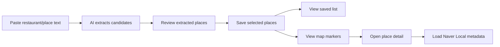
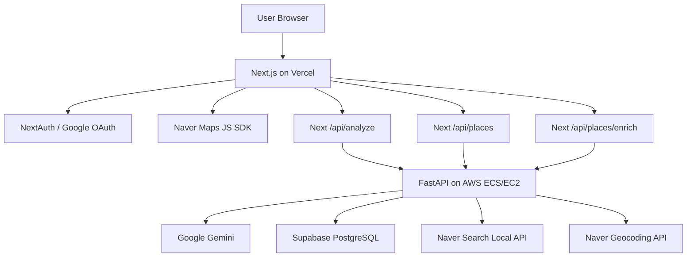

# Sple

> AI-assisted personal hot-place map for saving places from Instagram-style text.


Sple is a mobile-first PWA that helps users turn copied restaurant or place text into a personal map/list collection. Users paste Instagram captions or place recommendation text, AI extracts place candidates and short feature summaries, and signed-in users save those places to their own collection.

Live service: [https://www.sple-insta.com](https://www.sple-insta.com)  
Backend API: [https://api.sple-insta.com](https://api.sple-insta.com)  
Current product baseline: [docs/CURRENT_PRODUCT_UNDERSTANDING.md](docs/CURRENT_PRODUCT_UNDERSTANDING.md)

## Product Scope

Current scope focuses on **copy-and-paste text analysis**.

Instagram URL crawling and Meta DM automation were explored, but they are not part of the current MVP because Instagram URL analysis is frequently blocked as bot-like traffic and Meta DM integration requires additional platform review constraints.

## Core Features

### AI Place Extraction

- Extracts place name and address from pasted Korean social/recommendation text.
- Generates AI category and a short Korean feature summary when available.
- Supports multiple extracted places from one text input.
- Allows users to select which extracted places to save.

### Personal Place Collection

- Uses Google OAuth through NextAuth.
- Saves places per authenticated user.
- Supports list search and category filtering.
- Allows address correction for places that were saved with incomplete location data.

### Map View

- Uses Naver Maps JavaScript API.
- Shows a distinct current-location marker and separate saved-place markers.
- Places are rendered as orange pin markers; current location is a blue pulsing dot.
- Saved places with coordinates appear on the map.
- If a saved place only has an address, the frontend attempts browser-side geocoding.

### Naver Place Enrichment

- Uses Naver Search Local API on the backend to enrich saved places.
- Adds Naver place title, category, road address, phone number, and external link when available.
- Enrichment is triggered lazily from the map detail flow.
- Transient failures such as missing credentials or API errors are retried instead of being permanently cached.

### Mobile List UX

- The saved list screen is scrollable within the app viewport.
- Extra bottom padding prevents the bottom navigation from covering the final list items.
- The saved-place detail bottom sheet also supports internal scrolling on smaller screens.

## User Flow



## Routes

| Route | Description |
| --- | --- |
| `/` | Main map view with current-location marker and saved-place markers |
| `/add` | Paste text, run AI analysis, select places, and save |
| `/saved` | Search/filter saved places and edit missing addresses |
| `/profile` | Google sign-in/sign-out and user session area |
| `/privacy` | Privacy policy |
| `/terms` | Terms of service |
| `/data-deletion` | User data deletion guide |

## Tech Stack

| Area | Stack |
| --- | --- |
| Frontend | Next.js App Router, React 19, TypeScript 5, Tailwind CSS v4 |
| Backend | FastAPI, Python 3.12, Pydantic, SQLAlchemy Async |
| Database | Supabase PostgreSQL in production, SQLite fallback locally |
| AI | Google Gemini 2.5 Flash / Vertex AI through `google-genai` |
| Map | Naver Maps JavaScript API, Naver Geocoding API |
| Place Metadata | Naver Search Local API |
| Auth | NextAuth + Google OAuth |
| Deployment | Vercel frontend, AWS ECS/EC2 backend, Docker, Amazon ECR, GitHub Actions |

## Architecture



## Project Structure

```text
.
├── frontend/                 # Next.js frontend
│   ├── src/app/              # App Router pages and route handlers
│   ├── src/components/       # Shared UI and map/detail components
│   ├── src/components/layout/# Top/bottom app shell
│   ├── src/lib/              # API, auth, geocoding, marker, analysis helpers
│   └── tests/                # Frontend utility tests
├── src/                      # FastAPI backend
│   ├── main.py               # API endpoints and AI analysis
│   ├── database.py           # Database engine and ORM model
│   └── naver_place_search.py # Naver Local Search integration
├── migrations/               # Supabase SQL migrations
├── tests/                    # Backend/API tests
├── docs/                     # Product, design, QA, and implementation docs
├── .github/workflows/        # GitHub Actions backend deployment
└── Dockerfile                # Backend container build
```

## Environment Variables

### Vercel Frontend

```env
NEXTAUTH_URL=https://www.sple-insta.com
NEXTAUTH_SECRET=...
GOOGLE_CLIENT_ID=...
GOOGLE_CLIENT_SECRET=...
BACKEND_API_URL=https://api.sple-insta.com
BACKEND_API_KEY=...
NEXT_PUBLIC_NAVER_CLIENT_ID=...
NEXT_PUBLIC_ADSENSE_CLIENT_ID=...
```

Notes:

- `BACKEND_API_KEY` must match the backend value.
- `NEXT_PUBLIC_NAVER_CLIENT_ID` is used by the browser to load the Naver Maps JavaScript SDK.
- `NAVER_SEARCH_CLIENT_ID` and `NAVER_SEARCH_CLIENT_SECRET` are not needed in Vercel because Naver Local Search is called by the AWS backend.

### AWS Backend

```env
DATABASE_URL=postgresql+asyncpg://...
BACKEND_API_KEY=...
FRONTEND_URL=https://www.sple-insta.com
ALLOWED_ORIGINS=https://www.sple-insta.com,https://sple-insta.com

GEMINI_API_KEY=...
GCP_SA_KEY_JSON=...
GCP_PROJECT_ID=...
GCP_LOCATION=...

NEXT_PUBLIC_NAVER_CLIENT_ID=...
NAVER_CLIENT_SECRET=...
NAVER_SEARCH_CLIENT_ID=...
NAVER_SEARCH_CLIENT_SECRET=...
```

Notes:

- `NEXT_PUBLIC_NAVER_CLIENT_ID` and `NAVER_CLIENT_SECRET` are used by backend geocoding fallback.
- `NAVER_SEARCH_CLIENT_ID` and `NAVER_SEARCH_CLIENT_SECRET` are Naver Developers Search API credentials used for Local Search.
- GitHub Actions must pass these backend variables into the ECS task definition during deployment.

## Database Migrations

Run migrations in Supabase SQL Editor in order:

```text
migrations/2026-05-15_places_insert_compatibility.sql
migrations/2026-05-15_places_user_id_text.sql
migrations/2026-05-19_places_address_optional.sql
migrations/2026-05-19_places_geocoding_fields.sql
migrations/2026-05-27_places_naver_metadata.sql
```

The latest migration adds nullable Naver metadata columns:

- `naver_place_title`
- `naver_place_url`
- `naver_category`
- `naver_description`
- `naver_telephone`
- `naver_address`
- `naver_road_address`
- `naver_mapx`
- `naver_mapy`
- `naver_match_status`
- `naver_enriched_at`

## Local Development

### Backend

```bash
uv sync
uv run uvicorn src.main:app --reload --host 0.0.0.0 --port 8000
```

Health checks:

```bash
curl http://localhost:8000/health
curl http://localhost:8000/health/db
```

### Frontend

```bash
cd frontend
npm install
npm run dev
```

Local URL:

```text
http://localhost:3000
```

## Verification

### Frontend

```bash
cd frontend
npm run lint
npm run build
```

Frontend utility tests:

```bash
node --test frontend/tests/analyzed-place.test.mts frontend/tests/map-marker-styles.test.mts
```

### Backend

```bash
uv run pytest tests/test_e2e_api.py tests/test_places_api.py tests/test_naver_place_search.py tests/test_deploy_workflow.py -q
```

## Deployment

### Frontend

Frontend is deployed through Vercel.

After frontend changes:

1. Push changes to the connected repository branch.
2. Confirm Vercel deployment succeeds.
3. Verify the live service at [https://www.sple-insta.com](https://www.sple-insta.com).

### Backend

Backend is deployed through GitHub Actions to AWS ECS/EC2.

Deployment flow:

1. Push to `main`.
2. GitHub Actions runs backend contract tests.
3. Docker image is built and pushed to Amazon ECR.
4. ECS task definition is rendered with environment variables.
5. ECS service is updated.
6. `/health` and `/health/db` smoke tests run.

Required GitHub Secrets include:

```text
AWS_ACCESS_KEY_ID
AWS_SECRET_ACCESS_KEY
DATABASE_URL
BACKEND_API_KEY
FRONTEND_URL
GCP_SA_KEY_JSON
GOOGLE_CLIENT_ID
GOOGLE_CLIENT_SECRET
NEXTAUTH_SECRET
NEXT_PUBLIC_NAVER_CLIENT_ID
NAVER_CLIENT_SECRET
NAVER_SEARCH_CLIENT_ID
NAVER_SEARCH_CLIENT_SECRET
BACKEND_HEALTH_URL
```

## Recent Updates

- Added custom map marker styles for current location vs saved places.
- Added map place detail panel.
- Added backend Naver Local Search enrichment.
- Added retry behavior for transient Naver enrichment failures.
- Added AI category/summary preservation from analysis to saved places.
- Improved saved-list scrolling and bottom-sheet scrolling on small screens.
- Updated GitHub Actions deployment to pass Naver credentials into ECS.

## Roadmap

- Improve AI extraction with stricter schema validation.
- Add better duplicate-place handling.
- Add richer Naver metadata display after Local Search enrichment.
- Add analytics/monitoring for extraction and geocoding failure rates.
- Improve map UX for places far from the user's current location.

