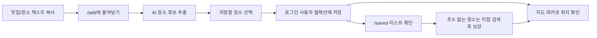
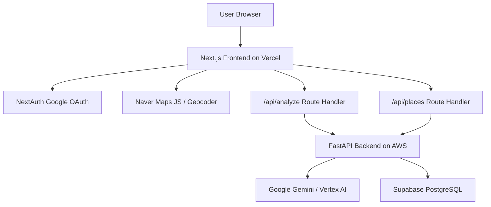

# Sple

> **LLM 기반 텍스트 분석을 활용한 인스타그램 맛집 지도 서비스**


Sple은 인스타그램 캡션이나 맛집 소개 글을 복사해 붙여넣으면 AI가 장소 후보를 추출하고, 사용자가 저장한 장소를 개인 지도와 리스트에서 다시 확인할 수 있는 모바일 중심 PWA 서비스입니다.

현재 제품 범위는 **텍스트 복사 붙여넣기 기반 장소 분석 MVP**입니다. Instagram URL 직접 분석과 Meta DM 자동화는 봇 탐지와 권한 이슈로 현재 범위에서 제외했습니다.

## Links

- Live Demo: [https://www.sple-insta.com](https://www.sple-insta.com)
- Backend API: [https://api.sple-insta.com](https://api.sple-insta.com)
- Product Note: [docs/CURRENT_PRODUCT_UNDERSTANDING.md](docs/CURRENT_PRODUCT_UNDERSTANDING.md)

## Why

인스타그램 맛집 콘텐츠는 저장해두기 쉽지만, 나중에 실제로 방문하려고 할 때 다시 찾기 어렵습니다.  
Sple은 흩어진 맛집 텍스트를 **AI 분석 → 개인 저장 → 지도/리스트 재탐색** 흐름으로 바꿔, 사용자가 발견한 장소를 자기만의 핫플레이스 컬렉션으로 관리할 수 있게 합니다.

## Core Features

- **AI 장소 추출**
  - 붙여넣은 텍스트에서 상호명과 주소 후보를 추출합니다.
  - 주소가 없어도 상호명이 있으면 장소 후보로 저장할 수 있습니다.

- **여러 장소 일괄 저장**
  - 한 글에서 여러 장소가 추출되면 체크 리스트로 보여줍니다.
  - 원하는 장소만 선택해 한 번에 저장할 수 있습니다.

- **지도 기반 장소 탐색**
  - Naver Maps JavaScript API로 지도 화면을 제공합니다.
  - 브라우저 위치 권한이 허용되면 현재 위치를 중심으로 지도를 표시합니다.
  - 좌표가 있는 저장 장소를 지도 마커로 표시합니다.

- **주소 보강과 지오코딩**
  - 주소가 없는 장소는 `주소 정보 없음` 상태로 저장합니다.
  - 저장 장소 상세에서 네이버 지도 검색으로 지점을 찾고 주소를 직접 보강할 수 있습니다.
  - 주소 저장 시 Naver Geocoding으로 위도/경도를 저장합니다.

- **개인 장소 리스트**
  - Google 로그인 기반으로 개인 장소 컬렉션을 관리합니다.
  - 저장 장소 검색과 카테고리 필터 UI를 제공합니다.

## User Flow



## Screens

| Route | Description |
| --- | --- |
| `/` | 지도 중심 홈 화면. 현재 위치와 저장 장소 마커를 표시합니다. |
| `/add` | 텍스트 붙여넣기 기반 AI 장소 분석과 일괄 저장 화면입니다. |
| `/saved` | 저장된 장소 리스트, 검색, 필터, 주소 보강 기능을 제공합니다. |
| `/profile` | Google 로그인과 사용자 프로필 상태를 제공합니다. |

## Key Implementation Points

- **Text-only AI extraction**
  - Instagram URL 크롤링 대신 사용자가 복사한 텍스트만 분석하도록 범위를 조정했습니다.
  - 봇 탐지와 외부 플랫폼 의존도를 줄이고, MVP 안정성을 우선했습니다.

- **Address-optional place saving**
  - 실제 맛집 콘텐츠에는 상호명만 있고 주소가 없는 경우가 많습니다.
  - 주소를 필수값에서 제외하고, 주소가 없는 장소도 저장 가능한 후보로 처리했습니다.

- **Geocoding-based map markers**
  - 주소가 있는 장소는 저장 시 Naver Geocoding으로 좌표를 함께 저장합니다.
  - 기존 저장 데이터 중 주소는 있지만 좌표가 없는 장소도 지도 진입 시 임시 지오코딩해 마커로 표시합니다.

- **Frontend route handler as backend gateway**
  - Next.js Route Handler가 세션 사용자 ID를 확인하고 FastAPI backend로 요청을 전달합니다.
  - `BACKEND_API_KEY`로 Vercel과 AWS backend 사이의 내부 API 호출을 보호합니다.

- **Production deployment pipeline**
  - Frontend는 Vercel에 배포합니다.
  - Backend는 Docker 이미지로 빌드해 AWS ECS/EC2 환경에 배포합니다.
  - GitHub Actions가 테스트, ECR push, ECS task definition 갱신, health check를 수행합니다.

## Tech Stack

| Area | Stack |
| --- | --- |
| Frontend | Next.js App Router, React, TypeScript, Tailwind CSS v4 |
| Auth | NextAuth Google Provider |
| Map | Naver Maps JavaScript API, Naver Geocoding |
| Backend | FastAPI, Pydantic, SQLAlchemy Async |
| AI | Google Gemini / Vertex AI via `google-genai` |
| Database | Supabase PostgreSQL, SQLite local fallback |
| Deployment | Vercel, AWS ECS/EC2, Docker, Amazon ECR, GitHub Actions |

## Architecture



## Project Structure

```text
.
├── frontend/                 # Next.js frontend
│   ├── src/app/              # App Router routes and route handlers
│   ├── src/components/       # UI components
│   ├── src/lib/              # API, auth, geocoding helpers
│   └── tests/                # frontend utility tests
├── src/                      # FastAPI backend
│   ├── main.py               # API routes and AI extraction
│   └── database.py           # SQLAlchemy model/session
├── migrations/               # Supabase SQL migrations
├── tests/                    # backend API tests
├── docs/                     # product, design, and operation docs
├── .github/workflows/        # GitHub Actions deploy workflow
└── Dockerfile                # backend container image
```

## Data Model

`places`

| Column | Description |
| --- | --- |
| `id` | Place ID |
| `user_id` | Google/NextAuth user ID |
| `name` | Place name |
| `address` | Address. Empty string when unknown |
| `category` | Category filter value |
| `rating` | Optional rating |
| `summary` | Optional AI/user summary |
| `latitude` | Latitude for map marker |
| `longitude` | Longitude for map marker |
| `geocoding_status` | `pending`, `resolved`, `failed` |

## Getting Started

### Backend

```bash
uv sync
uv run uvicorn src.main:app --reload --host 0.0.0.0 --port 8000
```

Health check:

```bash
curl http://localhost:8000/health
curl http://localhost:8000/health/db
```

### Frontend

```bash
cd frontend
npm install
npm run dev
```

Local URL:

```text
http://localhost:3000
```

## Verification

Frontend:

```bash
cd frontend
npm run lint
npx tsc --noEmit
npm run build
```

Naver geocoding utility test:

```bash
cd frontend
npx tsc --outDir .tmp/test-build --module NodeNext --moduleResolution NodeNext --target ES2022 --skipLibCheck --strict --noEmit false tests/naver-geocoding.test.mts src/lib/naver-geocoding.ts
node --test .tmp/test-build/tests/naver-geocoding.test.mjs
```

Backend:

```bash
uv run pytest tests/test_e2e_api.py tests/test_places_api.py -q
```

## Deployment

- `main` branch push triggers GitHub Actions backend deployment.
- Backend contract tests run before deployment.
- Docker image is pushed to Amazon ECR with `latest` and commit SHA tags.
- ECS task definition is updated with the new image and runtime environment variables.
- ALB health check verifies the deployed backend.
- Frontend deployment is handled by Vercel.

Production checks:

```text
https://api.sple-insta.com/health
https://api.sple-insta.com/health/db
https://www.sple-insta.com
```

## Database Migrations

Production Supabase DB should include:

```text
migrations/2026-05-15_places_insert_compatibility.sql
migrations/2026-05-15_places_user_id_text.sql
migrations/2026-05-19_places_address_optional.sql
migrations/2026-05-19_places_geocoding_fields.sql
```

The current version requires optional `address` handling and map marker columns: `latitude`, `longitude`, `geocoding_status`.

<details>
<summary>Environment Variables</summary>

### Frontend

```env
NEXTAUTH_URL=https://www.sple-insta.com
NEXTAUTH_SECRET=...
GOOGLE_CLIENT_ID=...
GOOGLE_CLIENT_SECRET=...
BACKEND_API_URL=https://api.sple-insta.com
BACKEND_API_KEY=...
NEXT_PUBLIC_NAVER_CLIENT_ID=...
```

### Backend

```env
DATABASE_URL=postgresql+asyncpg://...
BACKEND_API_KEY=...
FRONTEND_URL=https://www.sple-insta.com
GEMINI_API_KEY=...
GCP_SA_KEY_JSON=...
GCP_PROJECT_ID=...
GCP_LOCATION=...
```

`BACKEND_API_KEY` must use the same value in Vercel and AWS backend environments.

</details>

## Current Status

- Text copy/paste based place extraction is the active MVP direction.
- Instagram URL crawling and Meta DM automation are out of current scope.
- Name-only place candidates can be saved.
- Addressed places can be geocoded and rendered as map markers.
- Existing address-only records can be temporarily geocoded on the map screen.
- Privacy policy, terms, and data deletion pages are aligned with the current text-analysis product direction.

## Roadmap

- Replace JSON regex parsing with schema-based structured output.
- Add production monitoring for analyze/save failures.
- Replace `alert` based save feedback with toast or inline UI state.
- Improve category auto-classification and filtering.
- Improve branch selection UX for name-only places.
- Formalize Supabase migration workflow.

## Docs

- [Current Product Understanding](docs/CURRENT_PRODUCT_UNDERSTANDING.md)
- [Figma Design Guide](docs/FIGMA_DESIGN_GUIDE.md)
- [Design System Rules](docs/DESIGN_SYSTEM_RULES.md)
- [Production Hardening Progress](docs/2026-05-19_PRODUCTION_HARDENING_PROGRESS.md)
