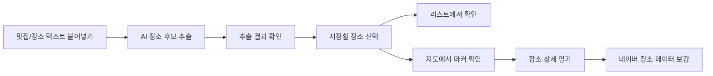
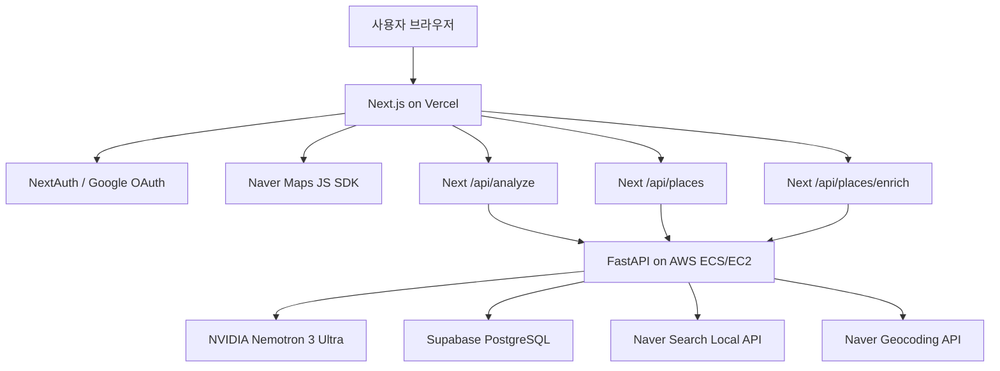

# Sple

> 인스타그램 맛집 글과 장소 추천 텍스트를 AI로 분석해 개인 지도와 리스트에 저장하는 핫플 컬렉션 서비스


Sple은 사용자가 인스타그램 캡션이나 맛집 추천 글을 복사해서 붙여넣으면, AI가 장소명과 주소, 카테고리, 특징 요약을 추출하고 로그인한 사용자가 해당 장소를 개인 지도와 리스트에 저장할 수 있도록 만든 모바일 중심 PWA 서비스입니다.

- 라이브 서비스: [https://www.sple-insta.com](https://www.sple-insta.com)
- 백엔드 API: [https://api.sple-insta.com](https://api.sple-insta.com)
- 현재 제품 기준 문서: [docs/CURRENT_PRODUCT_UNDERSTANDING.md](docs/CURRENT_PRODUCT_UNDERSTANDING.md)

## 프로젝트 범위

현재 MVP는 **텍스트 복사 붙여넣기 기반 장소 분석**에 집중합니다.

초기에는 인스타그램 URL 분석과 Meta DM 자동 분석 방향도 검토했지만, 인스타그램 URL 분석은 봇 감지 이슈가 잦고 Meta DM 연동은 플랫폼 권한과 심사 제약이 있어 현재 서비스 범위에서는 제외했습니다.

## 핵심 기능

### AI 장소 추출

- 사용자가 붙여넣은 한국어 맛집/장소 추천 텍스트에서 장소명과 주소를 추출합니다.
- 가능한 경우 AI 카테고리와 짧은 특징 요약도 함께 생성합니다.
- 하나의 글에서 여러 장소가 추출될 경우 체크리스트 형태로 선택 저장할 수 있습니다.

### 개인 장소 컬렉션

- Google OAuth 기반 로그인으로 사용자별 저장 공간을 분리합니다.
- 저장한 장소를 리스트에서 검색하고 카테고리별로 필터링할 수 있습니다.
- 주소가 없거나 부정확한 장소는 리스트 상세 화면에서 주소를 보완할 수 있습니다.

### 지도 화면

- Naver Maps JavaScript API를 사용합니다.
- 현재 위치 마커와 저장 장소 마커를 시각적으로 구분합니다.
- 현재 위치는 파란색 pulse dot, 저장 장소는 주황색 pin marker로 표시합니다.
- 좌표가 있는 저장 장소는 지도에 마커로 표시됩니다.
- 주소만 있는 장소는 프론트엔드에서 Naver Geocoding을 통해 좌표 복구를 시도합니다.

### 네이버 장소 데이터 보강

- 백엔드에서 Naver Search Local API를 호출해 저장 장소의 실제 네이버 검색 데이터를 보강합니다.
- 가능한 경우 네이버 기준 장소명, 카테고리, 도로명 주소, 전화번호, 링크를 저장합니다.
- 네이버 데이터는 지도 상세 흐름에서 필요할 때 지연 조회합니다.
- `missing_credentials`, `api_error` 같은 일시적 실패 상태는 영구 캐시하지 않고 재시도할 수 있게 처리했습니다.

### 모바일 리스트 UX

- 저장 리스트 화면은 앱 viewport 내부에서 스크롤됩니다.
- 하단 네비게이션에 마지막 항목이 가려지지 않도록 충분한 하단 여백을 둡니다.
- 장소 상세 bottom sheet도 화면 높이가 낮을 때 내부 스크롤로 끝까지 확인할 수 있습니다.

## 사용자 흐름



## 주요 화면

| 경로 | 설명 |
| --- | --- |
| `/` | 현재 위치와 저장 장소 마커를 보여주는 지도 화면 |
| `/add` | 텍스트 붙여넣기, AI 분석, 장소 선택 및 저장 화면 |
| `/saved` | 저장 장소 검색, 필터링, 주소 수정 화면 |
| `/profile` | Google 로그인/로그아웃 및 사용자 세션 화면 |
| `/privacy` | 개인정보처리방침 |
| `/terms` | 서비스 이용약관 |
| `/data-deletion` | 사용자 데이터 삭제 안내 |

## 기술 스택

| 영역 | 기술 |
| --- | --- |
| Frontend | Next.js App Router, React 19, TypeScript 5, Tailwind CSS v4 |
| Backend | FastAPI, Python 3.12, Pydantic, SQLAlchemy Async |
| Database | Supabase PostgreSQL, SQLite local fallback |
| AI | NVIDIA Nemotron 3 Ultra, `openai` Async SDK |
| Map | Naver Maps JavaScript API, Naver Geocoding API |
| Place Metadata | Naver Search Local API |
| Auth | NextAuth, Google OAuth |
| Deployment | Vercel, AWS ECS/EC2, Docker, Amazon ECR, GitHub Actions |

## 아키텍처



## 프로젝트 구조

```text
.
├── frontend/                  # Next.js 프론트엔드
│   ├── src/app/               # App Router 페이지와 route handler
│   ├── src/components/        # 공통 UI, 지도, 상세 컴포넌트
│   ├── src/components/layout/ # 상단/하단 앱 shell
│   ├── src/lib/               # API, auth, geocoding, marker, 분석 helper
│   └── tests/                 # 프론트엔드 유틸 테스트
├── src/                       # FastAPI 백엔드
│   ├── main.py                # API endpoint와 AI 분석 로직
│   ├── database.py            # DB 연결과 ORM 모델
│   └── naver_place_search.py  # Naver Local Search 연동
├── migrations/                # Supabase SQL migration
├── tests/                     # 백엔드/API 테스트
├── docs/                      # 제품, 디자인, QA, 구현 문서
├── .github/workflows/         # GitHub Actions 배포 workflow
└── Dockerfile                 # 백엔드 컨테이너 빌드 설정
```

## 환경변수

### Vercel Frontend

```env
NEXTAUTH_URL=https://www.sple-insta.com
NEXTAUTH_SECRET=...
GOOGLE_CLIENT_ID=...
GOOGLE_CLIENT_SECRET=...
BACKEND_API_URL=https://api.sple-insta.com
BACKEND_API_KEY=...
NEXT_PUBLIC_NAVER_CLIENT_ID=...
NEXT_PUBLIC_ADSENSE_CLIENT_ID=...
NEXT_PUBLIC_ADSENSE_SLOT=...
```

`NEXT_PUBLIC_ADSENSE_SLOT` is injected into the client bundle at build time. Set it to a real AdSense slot ID and redeploy; leave it unset to hide the banner.

주의:

- `BACKEND_API_KEY`는 백엔드의 `BACKEND_API_KEY`와 같은 값이어야 합니다.
- `NEXT_PUBLIC_NAVER_CLIENT_ID`는 브라우저에서 Naver Maps JavaScript SDK를 로드할 때 사용합니다.
- `NAVER_SEARCH_CLIENT_ID`, `NAVER_SEARCH_CLIENT_SECRET`는 Vercel에 넣지 않습니다. 네이버 Local Search는 AWS 백엔드에서 호출합니다.

### AWS Backend

```env
DATABASE_URL=postgresql+asyncpg://...
BACKEND_API_KEY=...
FRONTEND_URL=https://www.sple-insta.com
ALLOWED_ORIGINS=https://www.sple-insta.com,https://sple-insta.com

NVIDIA_API_KEY=...

NEXT_PUBLIC_NAVER_CLIENT_ID=...
NAVER_CLIENT_SECRET=...
NAVER_SEARCH_CLIENT_ID=...
NAVER_SEARCH_CLIENT_SECRET=...
```

주의:

- `NEXT_PUBLIC_NAVER_CLIENT_ID`, `NAVER_CLIENT_SECRET`는 백엔드의 Naver Geocoding fallback에서 사용합니다.
- `NAVER_SEARCH_CLIENT_ID`, `NAVER_SEARCH_CLIENT_SECRET`는 Naver Developers의 Search API 인증 정보이며, Local Search 기반 장소 데이터 보강에 사용합니다.
- GitHub Actions가 위 백엔드 환경변수를 ECS task definition으로 전달해야 실제 런타임에서 사용할 수 있습니다.

## 데이터베이스 마이그레이션

사용자 격리·AI 오류 처리·저장 재시도 변경과 배포 순서는 [안정화 안내](docs/2026-09-15_RELIABILITY.md)를 참고하세요.

Supabase SQL Editor에서 아래 migration을 순서대로 적용합니다.

```text
migrations/2026-05-15_places_insert_compatibility.sql
migrations/2026-05-15_places_user_id_text.sql
migrations/2026-05-19_places_address_optional.sql
migrations/2026-05-19_places_geocoding_fields.sql
migrations/2026-05-27_places_naver_metadata.sql
migrations/20260915052753_places_save_request.sql
```

`2026-05-27_places_naver_metadata.sql`는 네이버 장소 데이터 보강을 위해 아래 nullable 컬럼을 추가합니다.

- `naver_place_title`
- `naver_place_url`
- `naver_category`
- `naver_description`
- `naver_telephone`
- `naver_address`
- `naver_road_address`
- `naver_mapx`
- `naver_mapy`
- `naver_match_status`
- `naver_enriched_at`

## 로컬 개발

### Backend

로컬에서도 백엔드와 프론트엔드에 같은 `BACKEND_API_KEY`를 설정합니다. 키 없이 실행하는 개발 전용 예외는 `APP_ENV=development`, `ALLOW_INSECURE_LOCAL_AUTH=true`를 모두 명시해야 하며 운영에서는 사용하지 않습니다.

```bash
uv sync
uv run uvicorn main:app --app-dir src --reload --host 0.0.0.0 --port 8000
```

Health check:

```bash
curl http://localhost:8000/health
curl http://localhost:8000/health/db
```

### Frontend

```bash
cd frontend
npm install
npm run dev
```

로컬 주소:

```text
http://localhost:3000
```

## 검증

### Frontend

```bash
cd frontend
npm run lint
npm run build
```

프론트엔드 유틸 테스트:

```bash
node --test frontend/tests/*.test.mts
```

### Backend

```bash
uv run pytest -q
```

## 배포

### Frontend

프론트엔드는 Vercel로 배포합니다.

1. 연결된 GitHub repository에 변경사항을 push합니다.
2. Vercel deployment가 성공했는지 확인합니다.
3. [https://www.sple-insta.com](https://www.sple-insta.com)에서 실제 동작을 확인합니다.

### Backend

백엔드는 GitHub Actions를 통해 AWS ECS/EC2로 배포합니다.

배포 흐름:

1. `main` 브랜치에 push합니다.
2. GitHub Actions에서 백엔드 계약 테스트를 실행합니다.
3. Docker image를 빌드하고 Amazon ECR에 push합니다.
4. ECS task definition에 image와 환경변수를 반영합니다.
5. ECS service를 업데이트합니다.
6. `/health`, `/health/db` smoke test를 실행합니다.

필요한 GitHub Secrets:

```text
AWS_ACCESS_KEY_ID
AWS_SECRET_ACCESS_KEY
DATABASE_URL
BACKEND_API_KEY
FRONTEND_URL
NVIDIA_API_KEY
GOOGLE_CLIENT_ID
GOOGLE_CLIENT_SECRET
NEXTAUTH_SECRET
NEXT_PUBLIC_NAVER_CLIENT_ID
NAVER_CLIENT_SECRET
NAVER_SEARCH_CLIENT_ID
NAVER_SEARCH_CLIENT_SECRET
BACKEND_HEALTH_URL
```

## 최근 업데이트

- 현재 위치와 저장 장소를 구분하는 커스텀 지도 마커를 추가했습니다.
- 지도 장소 상세 패널을 추가했습니다.
- 백엔드에 Naver Local Search 기반 장소 데이터 보강을 추가했습니다.
- 일시적인 네이버 데이터 조회 실패 상태를 재시도할 수 있도록 개선했습니다.
- AI 분석 결과의 `category`, `summary`가 저장 흐름까지 이어지도록 개선했습니다.
- 저장 리스트와 장소 상세 bottom sheet가 작은 화면에서도 끝까지 스크롤되도록 개선했습니다.
- GitHub Actions 배포 과정에서 Naver 관련 backend 환경변수가 ECS에 전달되도록 정리했습니다.

## 향후 개선 방향

- AI 추출 결과를 더 엄격한 schema validation 기반으로 안정화
- 중복 장소 저장 방지 및 병합 UX 개선
- 네이버 장소 데이터 표시 영역 고도화
- AI 분석, geocoding, Naver enrichment 실패율 모니터링
- 사용자 현재 위치와 멀리 떨어진 장소를 더 쉽게 찾는 지도 UX 개선


## NVIDIA 장소 분석 설정

- 모델: `nvidia/nemotron-3-ultra-550b-a55b`, 엔드포인트: `https://integrate.api.nvidia.com/v1`.
- 로컬은 저장소 루트 `.env`에 `NVIDIA_API_KEY`를 설정한 뒤 백엔드를 재시작합니다.
- 운영은 GitHub Actions repository secret `NVIDIA_API_KEY`를 등록하고 백엔드를 배포합니다. Vercel이나 `NEXT_PUBLIC_` 변수에는 넣지 않습니다.
- 기존 Gemini/Vertex 키는 AI 분석에 사용하지 않습니다. Google 로그인 설정은 그대로 필요합니다.
- 추론 비활성화, 비스트리밍 비동기 호출, 전체 25초 제한 및 SDK 자동 재시도 비활성화로 기존 API 응답 계약을 유지합니다.
- JSON 배열을 프롬프트로 요청하고 서버에서 검증합니다. 잘린 응답/잘못된 JSON은 오류로 처리합니다.
- 키가 없으면 분석은 503을 반환합니다. 실제 모델 품질과 지연은 키 등록 후 확인해야 합니다.

## 건물명 주소의 좌표 복구

도로명/지번이 아닌 `용산 아이파크몰` 같은 주소는 주소 지오코딩 결과가 없을 수 있습니다. 저장·주소 수정·사용자 범위 좌표 복구에서 주소 변환이 실패하면 네이버 Local Search를 사용합니다. 이름과 위치가 한 후보에 명확히 일치할 때만 검색 좌표를 채택합니다. 후보가 불확실하면 주소를 직접 보완해야 합니다.

백엔드에 `NAVER_SEARCH_CLIENT_ID`, `NAVER_SEARCH_CLIENT_SECRET`가 필요합니다. 지도용 Naver Cloud 키와 별개인 Naver Developers 검색 API 키이며, GitHub Actions Secrets 등록 후 백엔드를 재배포해야 합니다.

기존 좌표 없는 장소는 배포 후 리스트 상세에서 `주소 저장`을 다시 실행하면 보완 처리가 적용됩니다. 검증되지 않은 위치로 기존 데이터를 일괄 변경하지 않습니다.
