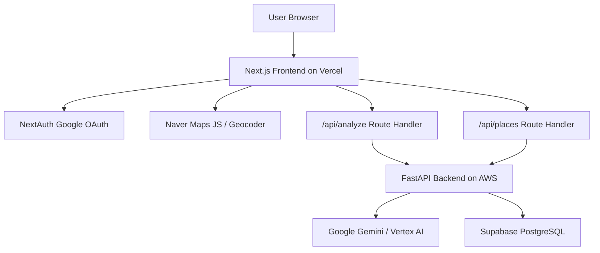

<aside>
📌

**이 페이지 사용법**

- 노션에 그대로 복사해서 붙여넣은 뒤, 비어 있는 링크와 이미지만 실제 자료로 교체하면 됩니다.
- AI Agent 개발자 포트폴리오용이라, 단순 CRUD 설명보다 “AI 기능을 실제 서비스로 연결한 과정”을 중심으로 정리했습니다.
- 스크린샷은 각 섹션에 적어둔 이미지 가이드에 맞춰 추가하면 됩니다.
</aside>

<aside>
🧾

**프로젝트 한 줄 요약(복붙용)**

- 무엇을: 인스타그램 맛집 글에서 장소 정보를 뽑아 개인 지도와 리스트에 저장하는 서비스를 만들었습니다.
- 어떻게: LLM으로 텍스트를 분석하고, 저장된 장소를 Naver Maps/Geocoding과 연결했습니다.
- 결과: 도메인 구매부터 프론트엔드, 백엔드, DB, 지도 API, 자동 배포까지 직접 연결해 실제 접속 가능한 서비스로 배포했습니다.
</aside>

<aside>
🏷️

**핵심 키워드**

- 역할: 개인 프로젝트, 기획부터 개발/배포/운영까지 담당
- 기술: LLM, Gemini/Vertex AI, Next.js, FastAPI, PostgreSQL, Supabase, Naver Maps, Vercel, AWS, GitHub Actions
- 지표: 라이브 도메인 배포, Google 로그인 기반 개인 저장, 장소 추출, 지도 마커 표시, GitHub Actions 자동 배포
</aside>

---

# 1. 프로젝트 개요

<aside>
📦

**기본정보**

- 서비스 소개: Sple은 인스타그램 캡션이나 맛집 소개 글을 복사해서 붙여넣으면, AI가 장소 후보를 찾아주고 사용자가 저장한 장소를 지도와 리스트에서 다시 볼 수 있는 모바일 중심 서비스입니다.
- 개발 환경(IDE/OS/배포): Windows, VS Code, Codex, GitHub, Vercel, Supabase, AWS, Naver Cloud Platform
- 기간: 2026.04 - 2026.05
- 팀 구성/역할: 개인 프로젝트. 서비스 방향 정리, 프론트엔드, 백엔드 API, DB 설계, AI 분석 로직, 지도 연동, 도메인 연결, 배포 자동화까지 직접 담당했습니다.
- 핵심 기능: 맛집 텍스트 장소 추출, Google 로그인, 개인 장소 저장, 리스트 조회, 지도 마커 표시, 주소 보강, Geocoding
- 결과물(레포/배포/문서): 라이브 서비스, Backend API, README, 운영 진행 문서
</aside>

| 항목 | 링크 |
| --- | --- |
| 발표자료 | 추가 예정 |
| 시연 영상 | 추가 예정 |
| 발표 영상 | 추가 예정 |
| 라이브 데모/배포 | https://www.sple-insta.com |
| Backend Health Check | https://api.sple-insta.com/health |
| DB Health Check | https://api.sple-insta.com/health/db |

<aside>
🏆

**핵심 성과(메인 문장)**

- **무엇을**: SNS 맛집 글을 개인 장소 데이터로 바꾸는 서비스를 만들었습니다.
- **어떻게**: LLM 분석 결과를 DB 저장, 지도 마커, 리스트 화면까지 연결했습니다.
- **어떤 결과**: 로컬 데모에서 끝내지 않고 도메인, 배포, DB, API key, CI/CD까지 운영 환경에 필요한 부분을 직접 구성했습니다.
</aside>

<aside>
🖼️

**추가하면 좋은 이미지**

- 메인 지도 화면
- `/add` 텍스트 입력 화면
- 여러 장소가 추출된 결과 화면
- `/saved` 저장 리스트 화면
- 장소 상세에서 주소를 보강하는 화면
- 지도에 마커가 표시된 화면
- Vercel 배포 화면 또는 도메인 연결 화면
- GitHub Actions 배포 성공 화면
- Supabase `places` 테이블 구조 화면
</aside>

---

# 2. 기획 및 문제 정의

<aside>
🎯

**Target & Problem**

- 타겟 사용자: 인스타그램이나 블로그에서 맛집 정보를 자주 저장하지만, 실제로 방문하려고 할 때 다시 찾기 어려운 사용자
- 핵심 문제(페인포인트):
  - SNS 저장은 콘텐츠를 저장하는 데는 편하지만, 장소를 다시 찾기에는 불편합니다.
  - 맛집 글에는 상호명, 지점명, 주소가 일정한 형식 없이 섞여 있습니다.
  - Instagram URL을 직접 분석하려고 하면 봇 탐지나 접근 제한 문제가 생길 수 있습니다.
  - 지도에 마커를 찍으려면 주소뿐 아니라 위도/경도 좌표도 필요합니다.
- 문제를 확인한 근거(데이터/인터뷰/가설):
  - 실제 맛집 글에는 주소 없이 상호명만 있는 경우가 많았습니다.
  - 주소를 필수로 두면 저장 가능한 콘텐츠가 너무 줄어들었습니다.
  - URL 분석보다 사용자가 복사한 텍스트를 분석하는 방식이 MVP 단계에서는 더 안정적이었습니다.
</aside>

<aside>
💡

**Solution**

- 해결 접근:
  - Instagram URL을 크롤링하는 대신, 사용자가 복사한 텍스트를 붙여넣는 방식으로 범위를 줄였습니다.
  - LLM을 사용해 비정형 텍스트에서 장소 후보를 추출했습니다.
  - 주소가 있으면 Geocoding으로 좌표를 저장하고, 주소가 없으면 장소명만 먼저 저장할 수 있게 했습니다.
- 주요 기능/흐름:
  1. 텍스트 붙여넣기
  2. AI 장소 후보 추출
  3. 저장할 장소 선택
  4. Google 로그인 기반 개인 저장
  5. 리스트와 지도에서 다시 확인
  6. 주소 없는 장소는 나중에 주소 보강
- 기대 효과:
  - SNS에서 본 맛집 글을 실제 방문 가능한 개인 지도 데이터로 바꿀 수 있습니다.
  - 사용자는 따로 메모하거나 다시 검색하지 않아도 장소 후보를 빠르게 저장할 수 있습니다.
</aside>

<aside>
🧭

**목표(최초에 하고자 했던 목표)**

- 정량 목표:
  - 실제 도메인에서 접속 가능한 MVP 만들기
  - 텍스트 분석 → 장소 저장 → 리스트 조회 → 지도 표시 흐름 완성
  - GitHub push 기반 자동 배포 파이프라인 구성
- 정성 목표:
  - AI 기능을 단순 데모가 아니라 실제 서비스 흐름 안에 넣어보기
  - 프론트엔드, 백엔드, DB, 지도 API, 배포까지 한 번에 연결해보기
- 범위(포함/제외):
  - 포함: 텍스트 기반 장소 추출, 장소 저장/조회, 지도 마커 표시, 주소 보강, 실제 도메인 배포
  - 제외: Instagram URL 직접 크롤링, Meta DM 자동화, 결제, 추천 알고리즘, 소셜 공유 기능
</aside>

---

# 3. 시스템 설계 (구조 설계, 기술 스택 선정 이유)

## 3-1. 시스템 아키텍처

<aside>
🖼️

**필요 이미지**

- 전체 아키텍처 다이어그램
- 사용자 요청 흐름 다이어그램
- 배포 파이프라인 다이어그램
</aside>

- 컴포넌트 구성:
  - Next.js: 화면, 인증 세션, Route Handler, 지도 SDK 로딩
  - FastAPI: AI 분석 API, 장소 저장/조회/수정 API
  - Supabase PostgreSQL: 사용자별 장소 데이터 저장
  - Naver Maps/Geocoding: 지도 표시와 주소 좌표 변환
  - GitHub Actions: backend 테스트, Docker build, AWS 배포
- 데이터 흐름:
  1. 사용자가 `/add`에서 맛집 텍스트를 입력합니다.
  2. Next.js Route Handler가 FastAPI `/api/analyze`를 호출합니다.
  3. FastAPI가 Gemini/Vertex AI로 장소 후보를 추출합니다.
  4. 사용자가 저장할 장소를 선택합니다.
  5. 주소가 있으면 Geocoding 후 좌표와 함께 저장합니다.
  6. `/saved`와 지도 화면에서 저장된 장소를 조회합니다.

## 3-2. 기술 스택 선정 이유

| 영역 | 사용 기술 | 선택 이유 |
| --- | --- | --- |
| Frontend | Next.js App Router, React, TypeScript | 화면과 Route Handler를 같은 프로젝트에서 관리하고, LLM 응답/장소/좌표 데이터를 타입으로 다루기 위해 선택했습니다. |
| UI | Tailwind CSS | 모바일 화면을 빠르게 만들고 수정하기 위해 사용했습니다. |
| Backend | FastAPI, Pydantic, SQLAlchemy Async | Python 기반 AI SDK와 잘 맞고, API와 데이터 검증을 빠르게 만들 수 있어 선택했습니다. |
| AI | Gemini/Vertex AI | 형식이 일정하지 않은 한국어 맛집 글에서 장소 후보를 뽑기 위해 사용했습니다. |
| Database | Supabase PostgreSQL | 운영 데이터를 확인하기 쉽고, SQL migration을 적용하기 편해 사용했습니다. |
| Map | Naver Maps JavaScript API, Geocoding | 한국 주소 기반 서비스라 네이버 지도와 주소 검색 경험이 더 자연스럽다고 판단했습니다. |
| Infra/DevOps | Vercel, AWS ECS/EC2, Docker, GitHub Actions | 프론트와 백엔드를 분리 배포하고, push 기반 자동 배포를 구성하기 위해 사용했습니다. |
| 품질 도구 | ESLint, TypeScript check, Next build, pytest, Node test | 기능 수정 후 최소한의 회귀 검증을 하기 위해 사용했습니다. |

---

# 4. 수행 과업 (무엇을 알고 있고, 할 수 있는지 노출)

<aside>
🛠️

**작성 원칙**

- 각 Task는 Task → Tech Action → Result 구조로 정리했습니다.
- 단순 구현 나열보다, 왜 그렇게 했는지와 어떤 문제가 풀렸는지를 중심으로 작성했습니다.
</aside>

## 4-1. 주요 Task (Task - Tech Action - Result)

### Task 1. LLM 기반 장소 추출 API 구현

- Task: 사용자가 붙여넣은 맛집 글에서 상호명과 주소 후보를 뽑아야 했습니다.
- Tech Action:
  - FastAPI `/api/analyze` 엔드포인트를 만들었습니다.
  - Gemini/Vertex AI에 텍스트를 보내 장소 후보를 JSON 형태로 받도록 구성했습니다.
  - URL만 입력된 경우는 제외하고, 실제 장소가 언급된 텍스트만 분석하도록 했습니다.
  - Next.js `/api/analyze` Route Handler에서 backend 응답을 받아 프론트 화면에 맞게 전달했습니다.
- Result:
  - 비정형 맛집 글에서 장소 후보를 추출하는 기본 흐름을 만들었습니다.
  - backend가 빈 응답이나 non-JSON 응답을 줄 때도 프론트가 바로 깨지지 않도록 처리했습니다.

### Task 2. Google 로그인 기반 개인 장소 저장 구현

- Task: 사용자별로 저장된 장소를 분리해서 보여줘야 했습니다.
- Tech Action:
  - NextAuth Google Provider로 로그인 세션을 구성했습니다.
  - Next.js Route Handler에서 세션의 `user.id`를 backend 요청에 넣었습니다.
  - FastAPI에 장소 저장, 조회, 수정 API를 만들었습니다.
  - Supabase의 `places.user_id` 타입 문제를 migration으로 정리했습니다.
- Result:
  - 로그인한 사용자가 본인이 저장한 장소만 볼 수 있는 흐름을 만들었습니다.
  - 저장 후 `/saved`에서 리스트로 다시 확인할 수 있게 했습니다.

### Task 3. 주소가 없는 장소도 저장 가능하게 개선

- Task: 실제 맛집 글에는 주소 없이 상호명만 있는 경우가 많았습니다.
- Tech Action:
  - 저장 조건을 `name` 필수, `address` 선택으로 바꿨습니다.
  - AI 프롬프트도 주소가 없어도 상호명이 있으면 후보로 반환하도록 수정했습니다.
  - 주소가 없는 장소는 리스트에서 `주소 정보 없음`으로 표시했습니다.
  - `/saved` 상세 화면에서 나중에 주소를 입력할 수 있게 했습니다.
- Result:
  - 주소가 없는 맛집 글도 저장 후보로 남길 수 있게 됐습니다.
  - 사용자가 나중에 네이버 지도에서 지점을 확인하고 주소를 보강할 수 있게 됐습니다.

### Task 4. 지도 마커와 Geocoding 연결

- Task: 저장한 장소를 지도에서 실제 마커로 보여줘야 했습니다.
- Tech Action:
  - Naver Maps JavaScript API를 지도 화면에 연결했습니다.
  - 주소가 있는 장소는 Naver Geocoding으로 위도/경도를 구해 저장했습니다.
  - 지도 화면에서는 좌표가 있는 장소만 마커로 표시했습니다.
  - 브라우저 위치 권한이 허용되면 현재 위치 중심으로 지도를 열도록 했습니다.
  - 이미 저장된 주소-only 데이터도 지도 화면에서 임시로 Geocoding해 마커를 표시하도록 했습니다.
- Result:
  - 저장된 장소가 리스트뿐 아니라 지도에서도 확인되도록 연결했습니다.
  - 주소와 좌표 데이터의 차이를 다루면서 지도 기능의 실제 제약을 정리할 수 있었습니다.

### Task 5. 도메인 구매부터 실제 서비스 배포까지 구성

- Task: 로컬에서만 동작하는 데모가 아니라 실제 도메인에서 접속 가능한 서비스로 만들고 싶었습니다.
- Tech Action:
  - 도메인을 구매하고 frontend/backend 도메인을 나눠 연결했습니다.
  - Next.js frontend는 Vercel에 배포했습니다.
  - FastAPI backend는 Docker 이미지로 만들어 AWS ECS/EC2 환경에 배포했습니다.
  - Supabase PostgreSQL을 운영 DB로 연결했습니다.
  - GitHub Actions로 backend 테스트, ECR push, ECS task definition 갱신, health check를 자동화했습니다.
- Result:
  - `https://www.sple-insta.com`에서 실제로 접속 가능한 서비스가 됐습니다.
  - 배포 후 생긴 API 503, 환경 변수, API key, ALB health check 문제를 직접 확인하고 수정했습니다.

## 4-2. 기술 선택 이유(핵심 의사결정)

<aside>
⚖️

**LLM 텍스트 분석**

- 선택한 기술/패턴: Gemini/Vertex AI 기반 텍스트 분석
- 대안(비교 대상): 정규식 파싱, Instagram URL 크롤링, Meta DM 자동화
- 선택 근거: 맛집 글은 형식이 일정하지 않아 정규식만으로 처리하기 어렵고, URL 크롤링은 봇 탐지 가능성이 높았습니다. Meta DM 자동화는 권한과 심사 이슈가 있어 MVP 단계에서는 부담이 컸습니다.
- 트레이드오프: LLM 응답을 더 안정적으로 다루려면 structured output 기반으로 바꾸는 것이 좋다고 봅니다.
</aside>

<aside>
⚖️

**Next.js Route Handler를 backend gateway로 사용**

- 선택한 기술/패턴: Next.js Route Handler가 세션을 확인한 뒤 FastAPI backend를 호출
- 대안(비교 대상): 브라우저에서 FastAPI 직접 호출
- 선택 근거: backend API key를 브라우저에 노출하지 않을 수 있고, NextAuth 세션에서 사용자 ID를 확인한 뒤 backend로 전달할 수 있습니다.
- 트레이드오프: Vercel과 AWS 양쪽의 환경 변수 값이 맞아야 해서 설정 실수가 나면 디버깅 포인트가 늘어납니다.
</aside>

<aside>
⚖️

**Supabase PostgreSQL**

- 선택한 기술/패턴: Supabase PostgreSQL
- 대안(비교 대상): SQLite만 사용, EC2에 직접 PostgreSQL 운영
- 선택 근거: SQL Editor로 운영 데이터를 확인하기 쉽고, MVP 단계에서 migration을 빠르게 적용하기 좋았습니다.
- 트레이드오프: RLS, user_id 타입, FK 정책은 초기에 더 신중히 잡았어야 했습니다.
</aside>

## 4-3. 트러블 슈팅 (원인 분석 - 해결방안 - 결과)

### 이슈 1. 장소 저장 후 리스트에 보이지 않음

- 이슈 요약
  - 증상: 장소 저장을 눌렀는데 `/saved` 화면에서 아무것도 보이지 않았습니다.
  - 영향 범위: 분석 → 저장 → 다시 보기라는 핵심 흐름이 끊겼습니다.
- 원인 분석
  - 원인 후보: 저장 API 문제, 조회 API 문제, DB schema 문제, 인증 사용자 ID 불일치
  - 확인 과정: 저장 API 응답과 Supabase SQL 오류를 확인했습니다.
  - 최종 원인: Supabase `places.user_id` 타입과 Google/NextAuth 사용자 ID 타입이 맞지 않았습니다.
- 해결 방안
  - 변경 내용: `places.user_id`를 text 기준으로 정리하고, 저장/조회 API가 같은 session user id를 사용하도록 수정했습니다.
  - 검증 방법: 저장 후 `/saved`에서 같은 사용자 데이터가 조회되는지 확인했습니다.
  - 재발 방지: backend 테스트에 저장/조회 케이스를 추가했습니다.
- 결과
  - 개선 지표(전/후): 저장 후 리스트 미노출 → 사용자별 저장 장소 조회 가능
  - 남은 리스크/후속 과제: Supabase RLS 정책을 운영 기준으로 더 정리할 필요가 있습니다.

### 이슈 2. 주소 없는 맛집 글 분석 실패

- 이슈 요약
  - 증상: 상호명은 있지만 주소가 없는 글에서 “장소명과 주소를 함께 찾지 못했다”는 메시지가 나왔습니다.
  - 영향 범위: 실제 SNS 맛집 글 중 많은 케이스가 저장 후보에서 빠졌습니다.
- 원인 분석
  - 원인 후보: AI 추출 실패, validation 기준 과도, 주소 필수 조건
  - 확인 과정: 주소가 없는 예시 글을 분석해보고, 프론트와 백엔드 validation 조건을 확인했습니다.
  - 최종 원인: 초기 validation이 `name`과 `address`를 모두 필수로 요구했습니다.
- 해결 방안
  - 변경 내용: 주소를 optional로 바꾸고, 상호명이 있으면 주소가 없어도 후보로 반환하도록 프롬프트를 수정했습니다.
  - 검증 방법: 주소 없는 맛집 글로 분석 후 장소 후보가 표시되는지 확인했습니다.
  - 재발 방지: backend 저장 테스트에 주소 없는 장소 케이스를 추가했습니다.
- 결과
  - 개선 지표(전/후): 주소 없는 글 저장 불가 → 상호명만 있어도 저장 가능
  - 남은 리스크/후속 과제: 주소 없는 장소의 지점 선택 UX를 더 자연스럽게 개선할 수 있습니다.

### 이슈 3. 지도 마커가 보이지 않음

- 이슈 요약
  - 증상: 장소를 저장했는데 지도에 마커가 보이지 않았습니다.
  - 영향 범위: 지도 서비스로서 가장 중요한 화면이 제대로 동작하지 않았습니다.
- 원인 분석
  - 원인 후보: 지도 API 권한 문제, DB 좌표 누락, Geocoding 실패, 응답 파싱 오류
  - 확인 과정: 저장 payload와 DB 컬럼을 확인하고, Naver Maps JS Geocoder 문서를 다시 확인했습니다.
  - 최종 원인: 저장 시 주소만 저장하고 좌표는 저장하지 않았고, Naver Geocoding 응답 포맷도 잘못 읽고 있었습니다.
- 해결 방안
  - 변경 내용: 저장할 때 주소를 Geocoding해 좌표와 `geocoding_status`를 같이 저장했습니다. `response.v2.addresses`와 기존 `result.items` 포맷을 모두 처리하도록 파서를 수정했습니다.
  - 검증 방법: Geocoding 유틸 테스트를 추가하고, 지도 화면에서 좌표가 있는 장소만 마커로 표시되는지 확인했습니다.
  - 재발 방지: 기존 주소-only 데이터도 지도 화면에서 임시 Geocoding 후 마커로 보여주도록 했습니다.
- 결과
  - 개선 지표(전/후): 저장 후 지도 마커 미표시 → 좌표가 있는 장소는 지도 마커 표시 가능
  - 남은 리스크/후속 과제: Geocoding 실패 로그와 운영 모니터링을 더 보강해야 합니다.

### 이슈 4. AWS backend 배포 후 API 503 발생

- 이슈 요약
  - 증상: ECS 서비스는 떠 있는데 `https://api.sple-insta.com/health`가 503을 반환했습니다.
  - 영향 범위: 프론트에서 분석/저장 API를 사용할 수 없었습니다.
- 원인 분석
  - 원인 후보: backend 프로세스 오류, task health check 실패, ALB target group 불일치
  - 확인 과정: GitHub Actions smoke test 실패 로그, ECS task IP, ALB target group health를 비교했습니다.
  - 최종 원인: ALB listener가 현재 healthy target group이 아니라 다른 target group을 바라보고 있었습니다.
- 해결 방안
  - 변경 내용: GitHub Actions에 ALB listener 보정 단계를 추가했습니다.
  - 검증 방법: 배포 후 `/health`, `/health/db` 응답을 확인했습니다.
  - 재발 방지: health check 재시도 로직을 추가했습니다.
- 결과
  - 개선 지표(전/후): 배포 후 503 발생 → healthy target group 기준으로 listener 보정 가능
  - 남은 리스크/후속 과제: AWS 권한 정책과 ALB 구성을 더 단순화할 수 있습니다.

### 이슈 5. Service Worker fetch 오류

- 이슈 요약
  - 증상: `/add` 이동 중 `[SW] Fetch failed` 경고가 발생했습니다.
  - 영향 범위: 사용자가 네트워크 문제로 오해할 수 있었습니다.
- 원인 분석
  - 원인 후보: 네트워크 장애, Vercel 라우팅 문제, Service Worker 캐시 문제
  - 확인 과정: 브라우저 콘솔과 Application 탭의 Service Worker 상태를 확인했습니다.
  - 최종 원인: 기존 Service Worker가 navigation request를 가로채면서 network error response를 만들 수 있었습니다.
- 해결 방안
  - 변경 내용: 현재 MVP에서는 offline cache가 핵심이 아니라고 보고 Service Worker 등록을 해제했습니다.
  - 검증 방법: 브라우저 콘솔에서 SW fetch 경고가 사라지는지 확인했습니다.
  - 재발 방지: Cache Storage 정리 코드도 함께 추가했습니다.
- 결과
  - 개선 지표(전/후): 불필요한 SW fetch 경고 발생 → 경고 제거
  - 남은 리스크/후속 과제: 추후 offline 기능을 다시 도입한다면 캐시 전략을 명확히 잡아야 합니다.

---

# 5. 결과 보고

<aside>
📈

**정량적 성과**

- 라이브 도메인 배포 완료
- Frontend lint/type/build 통과
- Backend health check API 구성
- Geocoding 유틸 테스트 추가
- 텍스트 분석 → 장소 저장 → 리스트 조회 → 지도 표시 흐름 구현

**추가하면 좋은 지표**

- GitHub Actions 최근 배포 성공 화면
- Lighthouse 모바일 점수
- API 평균 응답 시간
- LLM 분석 성공/실패 샘플 수
- 실제 저장된 테스트 장소 수
</aside>

<aside>
🧠

**정성적 리뷰**

- 기술적 인사이트:
  - AI 기능은 모델 호출보다, 응답을 서비스 데이터로 안전하게 바꾸는 과정이 더 중요했습니다.
  - 외부 API는 권한만 확인하면 끝나는 게 아니라 응답 포맷, 도메인 제한, 브라우저 로딩 타이밍까지 같이 봐야 했습니다.
  - 실제 배포를 해보니 프론트, 백엔드, DB, 도메인, CI/CD 중 하나만 어긋나도 서비스 흐름이 끊긴다는 걸 체감했습니다.
- 리팩토링 방향성:
  - Gemini 응답 파싱을 regex에서 structured output으로 바꾸기
  - 장소 카테고리 자동 분류 추가
  - 주소 후보가 여러 개일 때 사용자가 지점을 선택할 수 있는 UX 개선
  - API 실패 로그와 모니터링 강화
- 아쉬운 점:
  - 처음에는 Meta DM 자동화까지 생각했지만 권한과 정책 이슈로 MVP에서 제외했습니다.
  - 초기 DB schema를 인증 사용자 ID 기준으로 더 빨리 정리했으면 migration 비용을 줄일 수 있었습니다.
  - 지도 마커를 위해 주소와 좌표의 데이터 정합성을 더 일찍 설계했으면 좋았을 것 같습니다.
</aside>

## 5-3. 현재 시점에서 다시 한다면

- 지금 다시 한다면 바꾸는 설계/구현:
  - LLM 응답을 처음부터 schema 기반으로 받도록 설계
  - 주소 후보와 좌표 상태를 별도 모델로 분리
  - Geocoding 실패 로그와 재시도 정책 추가
- 기술 스택/아키텍처 재선정:
  - Next.js Route Handler 구조는 유지
  - backend observability와 migration 관리는 더 일찍 도입
- 더 명확히 잡을 지표/목표:
  - AI 장소 추출 성공률
  - 저장 성공률
  - Geocoding 성공률
  - 지도 마커 표시 성공률
- 후속 확장 아이디어:
  - 장소 카테고리 자동 분류
  - 장소별 메모/태그
  - 지도 기반 필터
  - 친구와 장소 리스트 공유

---

# 포트폴리오 어필 가이드

<aside>
⭐

**가장 강조할 메시지**

이 프로젝트에서 가장 보여주고 싶은 부분은 “AI 기능을 만들었다”보다, **AI 기능이 실제 서비스 안에서 돌아가도록 끝까지 연결했다**는 점입니다.

추천 문장:

> LLM 기반 장소 추출 기능을 Next.js/FastAPI 서비스에 붙이고, 도메인 구매부터 Vercel, Supabase, AWS, GitHub Actions 배포까지 직접 구성해 실제 접속 가능한 맛집 지도 서비스를 만들었습니다.
</aside>

## 말할 때의 흐름

1. 문제 정의  
   “SNS에 맛집 글을 저장해도 실제로 방문하려고 하면 다시 찾기 어렵다.”

2. AI를 쓴 이유  
   “맛집 글은 형식이 제각각이라 정규식보다 LLM이 더 적합하다고 봤다.”

3. 범위 조정  
   “처음에는 Instagram URL 분석도 고려했지만, 봇 탐지 가능성이 있어 텍스트 붙여넣기 방식으로 MVP를 좁혔다.”

4. 실제 서비스화  
   “프론트, 백엔드, DB, 지도 API, 도메인, 자동 배포까지 연결했다.”

5. 운영 중 만난 문제  
   “DB 타입 문제, 지도 좌표 문제, AWS 503, Service Worker 오류를 로그와 재현을 보면서 해결했다.”

## 도메인 구매부터 실제 서비스까지의 어필 방식

- 도메인을 구매하고 frontend와 backend 도메인을 분리했습니다.
- Vercel에는 Next.js frontend를 배포했습니다.
- AWS에는 FastAPI backend를 Docker 기반으로 배포했습니다.
- Supabase PostgreSQL을 운영 DB로 연결하고 migration을 직접 적용했습니다.
- GitHub Actions로 push 기반 자동 배포를 구성했습니다.
- 배포 후 health check, ALB listener, API key, 환경 변수 문제를 직접 해결했습니다.

이렇게 쓰면 단순히 화면만 만든 프로젝트가 아니라, 실제 서비스 운영까지 경험한 프로젝트로 보입니다.

## 줄여도 되는 내용

- 화면 UI에 대한 자세한 설명
- 단순 CRUD 설명
- Tailwind 클래스 단위 구현 설명
- 광고 배너나 약관 페이지 같은 부가 기능
- Meta DM 자동화 시도 과정의 세부 절차

## 꼭 남겨야 하는 내용

- 왜 LLM을 사용했는지
- LLM 응답을 어떻게 실제 서비스 데이터로 바꿨는지
- 주소가 없는 장소를 어떻게 처리했는지
- Geocoding과 지도 마커를 어떻게 연결했는지
- 도메인, DB, 배포, CI/CD까지 어떻게 실제 서비스로 연결했는지
- 장애나 오류를 어떻게 원인 분석하고 해결했는지
